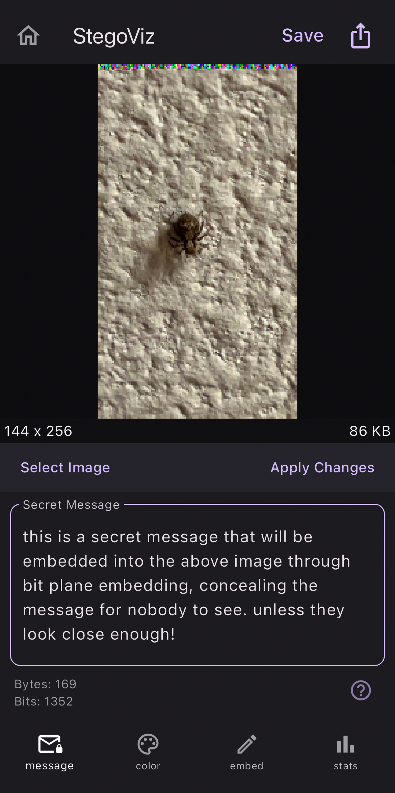
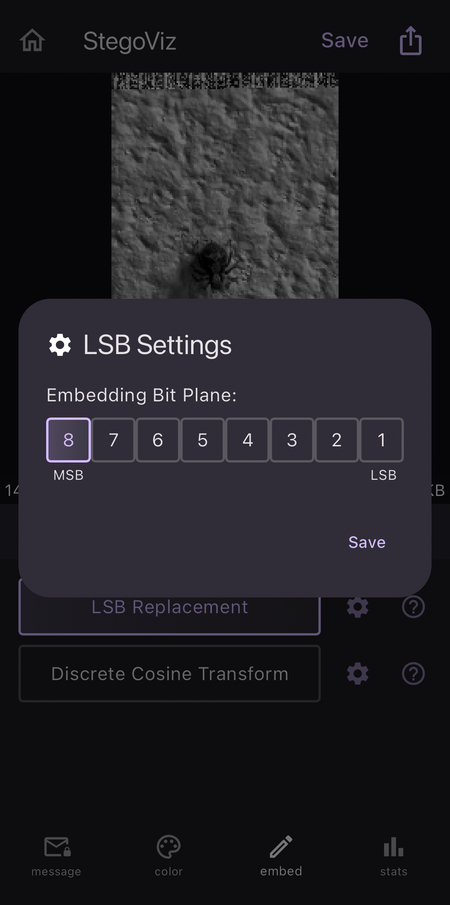

# StegoViz
Steganography education and visualization mobile application tool built with the Flutter framework

## About the Project  
Steganography is the practice of concealing information in such a way that its presence is not detectable to the observer. Unlike encryption, which only obscures the content of the message, steganography hides the very existence of the message itself. In most cases, images are used to conceal and hide the message by embedding the message within the bits that make up the digital image.

StegoViz allows users to wrap their head around this process by applying it easily to their own images and visualizing the effects!

> [!IMPORTANT]  
> This app is not released to the App Store or Google Play store. If you wish to use the application, you must download the necessary SDK's (shown in prerequisites) to build and run the app locally

## Prerequisites
**Flutter**  
You will need to have the latest version of Google's Flutter framework installed on your machine. This comes bundled with the Dart programming language SDK. Navigate to the [Flutter page](https://docs.flutter.dev/get-started/install) for instructions on how to install.

**Android Studio**  
The most supported IDE for Flutter development is Android Studio. Navigate to the [Android Studio page](https://developer.android.com/studio/install) for instructions on how to install.

## Screenshots

  
  
  

